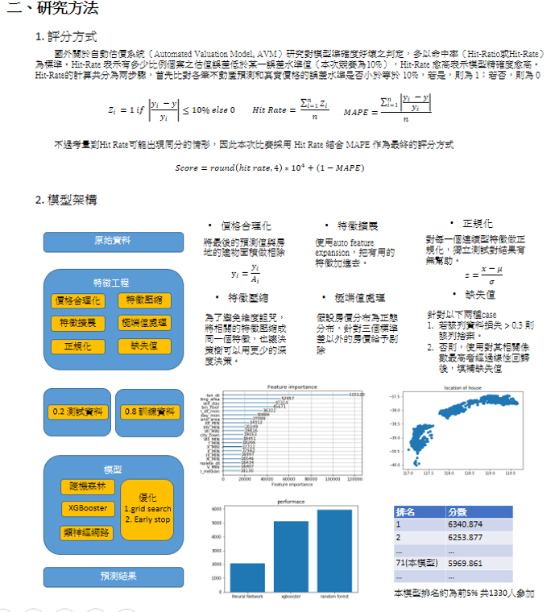

# 台灣房價預測競賽

[比賽網址](https://tbrain.trendmicro.com.tw/Competitions/Details/6)

## 摘要

    地價的預測在機器學習的領域中，有許多商業人士無不希望可以透過機器 學習的技術來達到預測房價，藉此找到投資下手的機會。在這次台灣的 Tbrain 在網路上舉辦的玉山人工智慧公開挑戰賽 2019 夏季 賽-台灣不動產 AI 神預測比賽中，提供了大量的地產資料以及相關的特徵，希 望能夠透過機器學習的 技術預測台灣的房價，雖說這是不是一個新題目，但是這是台灣第一次釋出房地產的資料的競賽，仍然有落地實踐的價值。比賽希望可以透過機器學習的技術分析房產的資訊，比如說房產的土地面積、所在的城市地段、甚至是社區的教育程度等等來預測房價最後的價格。本專題以比賽作為自我評分的標準，開發基於機器學習的模型預測房價。

## 研究方法
